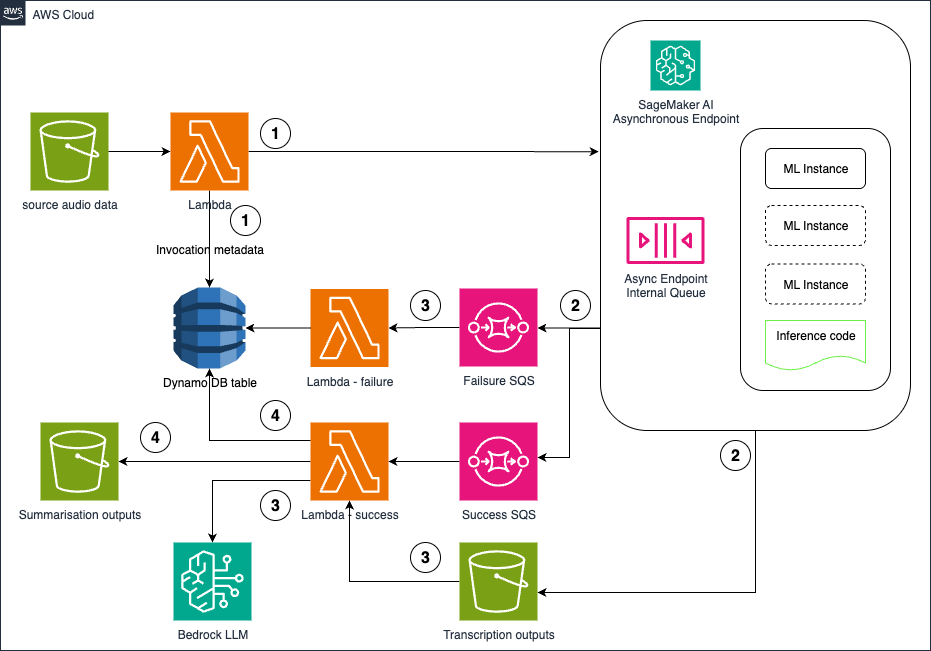

# Serverless Audio Processing with SageMaker Async Inference

A comprehensive AWS CDK solution that demonstrates how to build a scalable, serverless audio processing pipeline using SageMaker asynchronous inference endpoints. This project showcases an event-driven architecture that automatically processes audio files stored in S3, tracks their status, and provides intelligent summarization using Amazon Bedrock.

## Architecture Overview



This solution implements a serverless workflow that processes audio files through multiple stages:

### Core Components

- **Lambda Functions**: Orchestrate the processing workflow and handle status updates
- **DynamoDB**: Provides persistent status tracking and prevents duplicate processing
- **SageMaker Async Inference**: Handles ML model inference for audio transcription
- **SNS Topics**: Enable event-driven communication between services
- **Amazon Bedrock**: Powers AI-driven content summarization and analysis
- **S3 Storage**: Manages input audio files and output transcriptions

## End-to-End Workflow

### 1. Initial Processing (Lambda Trigger)
When the S3 SageMaker Processor Lambda function is invoked with a bucket URI:

- **File Discovery**: Scans the specified S3 bucket and prefix for audio files
- **Duplicate Prevention**: Checks DynamoDB to identify files that haven't been processed
- **Status Initialization**: Creates processing records in DynamoDB with "processing" status
- **Batch Submission**: Submits files to the SageMaker async inference endpoint in optimized batches

### 2. Asynchronous Inference (SageMaker)
The SageMaker async inference endpoint:

- **Queue Management**: Uses an internal queue to handle multiple inference requests
- **ML Processing**: Processes audio files through the deployed ML model (Parakeet ASR)
- **Scalable Compute**: Automatically scales ML instances based on workload demand
- **Output Generation**: Stores transcription results in designated S3 output locations

### 3. Status Tracking and Notifications (SNS + Lambda)
Upon completion or failure:

- **SNS Notifications**: SageMaker publishes status updates to success/failure SNS topics
- **Status Processing**: SNS Status Updater Lambda processes these notifications
- **Database Updates**: Updates DynamoDB records with completion status and output locations
- **Error Handling**: Captures and logs any processing failures for troubleshooting

### 4. Intelligent Summarization (Bedrock Integration)
For successful transcriptions:

- **Content Analysis**: Retrieves transcription outputs from S3
- **AI Summarization**: Uses Amazon Bedrock (Claude 3.5 Sonnet) to generate intelligent summaries
- **Enhanced Metadata**: Stores summarized content alongside original transcriptions

## Key Features

### Scalability & Performance
- **Serverless Architecture**: Automatically scales based on demand without infrastructure management
- **Batch Processing**: Optimizes throughput by processing multiple files simultaneously
- **Async Processing**: Non-blocking workflow allows handling large volumes of audio files

## Prerequisites

Before deploying this solution, ensure you have:

1. **AWS CLI configured** with appropriate permissions
2. **AWS CDK installed** - [Installation Guide](https://docs.aws.amazon.com/cdk/v2/guide/getting_started.html)
3. **Node.js 18+** and **Python 3.9+** installed
4. **SageMaker Endpoint** deployed with your ML model (Parakeet ASR or similar)
5. **SNS Topics** created for success and failure notifications

## Setup and Deployment

### 1. Environment Setup

Clone the repository and install dependencies:

```bash
# Clone the repository
git clone <repository-url>
cd <your-local-path>/sagemaker-async-batch-inference-cdk

# Install Node.js dependencies
npm install

# Set up Python virtual environment
python3 -m venv .venv
source .venv/bin/activate  # On Windows: .venv\Scripts\activate
pip install -r requirements.txt
```

### 2. Configuration

Update the SageMaker endpoint configuration in `bin/aws-blog-sagemaker.ts`:

```typescript
sageMakerConfig: {
  endpointName: 'your-sagemaker-endpoint-name',
  enableSageMakerAccess: true
}
```

### 3. Build and Deploy

```bash
# Compile TypeScript to JavaScript
npm run build

# Bootstrap CDK (first time only)
npx cdk bootstrap

# Review the changes that will be deployed
npx cdk diff

# Deploy the stack
npx cdk deploy
```

### 4. Verify Deployment

After successful deployment, note the output values:
- DynamoDB table name for status tracking
- Lambda function ARNs for processing and status updates
- SNS topic ARNs for notifications

## Usage

### Processing Audio Files

Invoke the S3 SageMaker Processor Lambda function with a bucket URI:

```json
{
  "bucket_uri": "s3://your-bucket-name/audio-files-prefix/"
}
```

### Monitoring Progress

Check processing status in the DynamoDB table:
- **processing**: File submitted to SageMaker
- **submitted**: Successfully queued for inference
- **completed**: Transcription completed successfully
- **failed**: Processing encountered an error

### Sample Data Setup

Use the included script to download and upload sample audio data:

```bash
# Install required dependencies
brew install ffmpeg

# Activate virtual environment and run sample data script
source .venv/bin/activate
python scripts/download_and_upload_dataset.py \
  --bucket your-bucket-name \
  --prefix audio-samples \
  --max-samples 10
```

## Architecture Benefits

### Event-Driven Design
- **Loose Coupling**: Components communicate through events, enabling independent scaling
- **Fault Tolerance**: Failed components don't cascade failures to other parts
- **Extensibility**: Easy to add new processing stages or notification channels

### Serverless Advantages
- **No Infrastructure Management**: Focus on business logic, not server maintenance
- **Automatic Scaling**: Handles traffic spikes without manual intervention
- **Cost Efficiency**: Pay only for actual usage, not idle capacity

### AI/ML Integration
- **Modern AI Stack**: Combines traditional ML (SageMaker) with generative AI (Bedrock)
- **Flexible Model Support**: Easy to swap different ML models for various use cases
- **Intelligent Processing**: Automated summarization adds value beyond basic transcription

## Contributing

This project follows AWS best practices for CDK development:

- **Infrastructure as Code**: All resources defined in version-controlled CDK code
- **Type Safety**: TypeScript ensures compile-time error detection
- **Comprehensive Testing**: Unit and integration tests for both infrastructure and Lambda code
- **Security First**: IAM roles follow principle of least privilege

## License

This project is licensed under the MIT License - see the LICENSE file for details.

---

*This solution demonstrates modern serverless architecture patterns for AI/ML workloads on AWS, showcasing how to build scalable audio processing pipelines.*