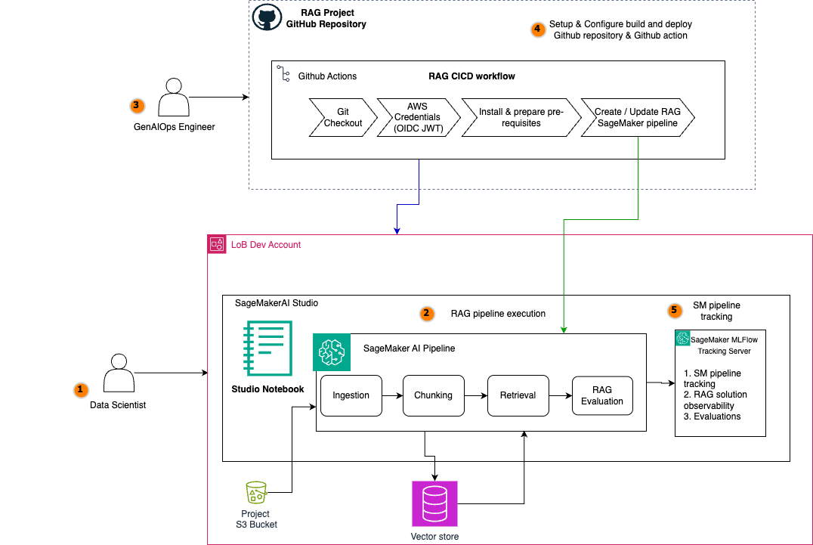
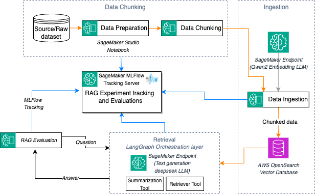
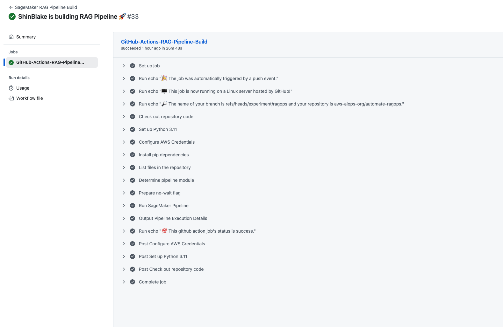
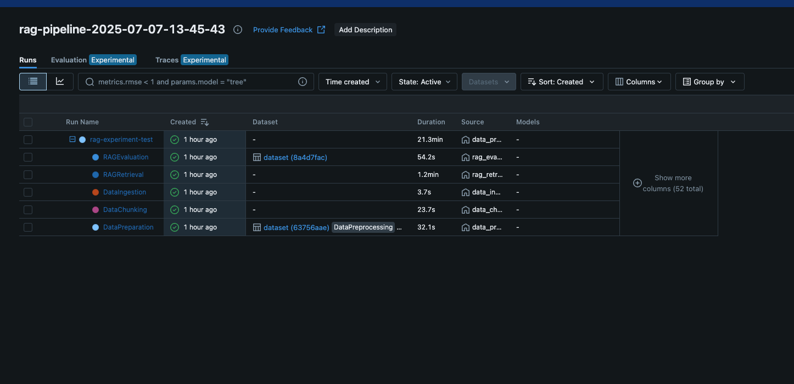
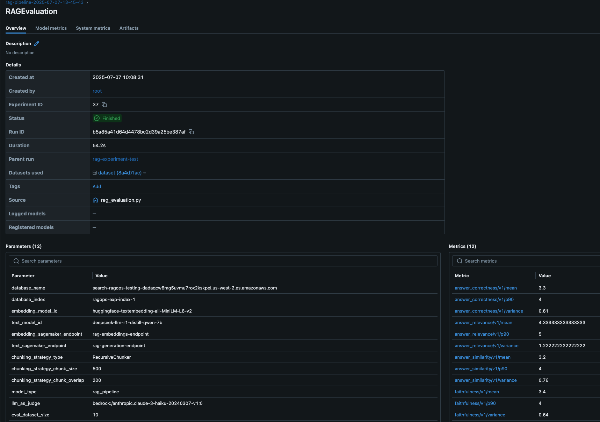
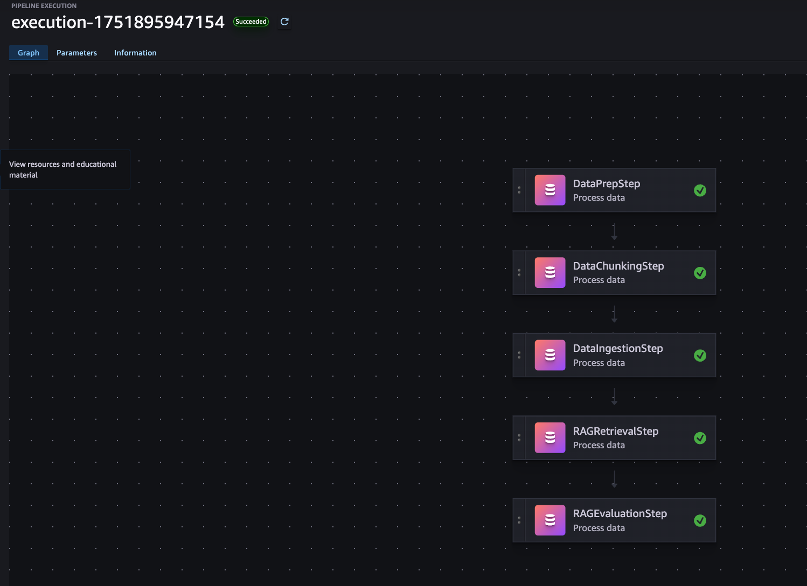

# Automate Retrieval-Augmented Generation pipeline (RAGOps)

This repository contains tools and utilities for automating RAG (Retrieval-Augmented Generation) pipeline and operations using SageMakerAI.

### RAG pipeline solutioning
A scalable RAG pipeline built on Amazon SageMakerAI, with MLflow experiment tracking seamlessly integrated at every stage and the RAG pipeline automated using SageMaker pipeline.  Integrated with GitOps CI/CD practices, SageMaker Pipelines enable seamless promotion of validated RAG configurations from development to staging and production environments while maintaining infrastructure-as-code (IaC) traceability.



RAG pipeline experimentation
In the experimentation phase, the SageMaker managed MLflow is used for organizing RAG pipeline.The key components of the RAG workflow are ingestion, chunking, retrieval, evaluation. The MLflow dashboard makes it easy to visualize and analyze these parameters and metrics, supporting data-driven refinement of the chunking stage within the RAG pipeline.




## Prerequisites

- Python >= 3.13
- [uv](https://github.com/astral-sh/uv) - Fast Python package installer and resolver

## Installation

1. Clone the repository:
```bash
git clone https://github.com/yourusername/automate-ragops.git
cd automate-ragops
```

2. Install dependencies using uv:
```bash
uv pip sync pyproject.toml
```

## Project Structure

```
automate-ragops/
├── .github/workflows
│   └── build_sagemaker_pipeline.yml
├── notebooks/
│   └── sagemaker-mlflow-experiment-agenticrag.ipynb
│   └── sagemaker-pipeline-building.ipynb
│   └── utils.py
├── sagemaker_pipeline/
│   └── pipeline_modules/     <---------- contains the modules for creating single and multi step sagemaker pipeline 
│   └── steps/     <--------- contains the script for multi and single step sagemaker pipeline scripts
│   └── run_pipeline.py
│   └── get_pipeline_definition.py
│   └── utils.py
│   └── requirements.txt
├── pyproject.toml
├── uv.lock
└── README.md
```

### Pre-requisite setup: Github connection and setup

1. Setup IAM OpenID Connect (OIDC) identity provider for github [AWS Documentation](https://docs.github.com/en/actions/security-for-github-actions/security-hardening-your-deployments/configuring-openid-connect-in-amazon-web-services). This connection will be used to perform Github CICD using the GitHub Action Pipeline CI/CD (preferred method). Skip this step if you already have a github connection or check with your organiztion if they already have Githib connection enabled.

2. Create an IAM role using the OIDC identity provider. OIDC allows your GitHub Actions workflows to access resources in Amazon Web Services (AWS) without storing the AWS credentials as long-lived GitHub secrets. Follow the [Github Documentation](https://docs.github.com/en/actions/deployment/security-hardening-your-deployments/configuring-openid-connect-in-amazon-web-services) for instructions to configure the IAM trust policy.


    Assign the following additional permissions to this role:
    ```
        AmazonS3FullAccess
        AmazonSageMakerFullAccess
    ```

3. Create the following github secrets and variables which will be consumed by the Github action job. These secrets will needed for both model build and model deploy github actions. See [Github documentation](http://docs.github.com/en/actions/security-for-github-actions/security-guides/using-secrets-in-github-actions) for instructions on how to create Github secrets.

#### Secrets

- `SAGEMAKER_PIPELINE_ROLE_ARN`: The ARN of the IAM role used to create and execute SageMaker Pipelines.
- `PIPELINE_EXECUTION_ROLE_ARN`: The ARN of the IAM role used to give GitHub Actions access to AWS resources.
- `ARTIFACT_BUCKET`: The S3 bucket used to store artifacts like datasets and models.

#### Variables

- `MLFLOW_URI`: The ARN of the SageMaker MLflow tracking server.
- `AWS_REGION`: The AWS region where SageMaker resources are deployed (example: `us-west-2`).
- `EMBEDDING_ENDPOINT_NAME`: The name of the SageMaker endpoint for embedding generation 
- `TEXT_ENDPOINT_NAME`: The name of the SageMaker endpoint for text generation.
- `DOMAIN_NAME`: The OpenSearch domain endpoint.
- `PROCESSING_INSTANCE_TYPE`: The SageMaker instance type for processing jobs (example: `ml.m5.4xlarge`).
- `PROCESSING_INSTANCE_COUNT`: The number of instances for processing jobs (example: `1`).

    

4. To execute the github actions, after successfully Github connection configurations. 
    * Open the cloned repository on your laptop or SMUS project notebook command line
    * Make change to the path `sagemaker_pipeline/**` and commit the changes `git commit -m "<ENTER>"`
    * Push your changes which triggers the github action job execution `git push`


## Dependencies

The project uses the following main dependencies (as specified in pyproject.toml):

- certifi >= 2025.4.26
- datasets >= 3.6.0
- ipykernel >= 6.29.5
- langchain-text-splitters >= 0.3.8
- mlflow == 2.22.1
- opensearch-py >= 2.8.0
- requests-aws4auth >= 1.3.1
- sagemaker-mlflow >= 0.1.0
- sagemaker >= 2.210.0
- importlib-metadata >= 7.0.1

## Usage


1. Start by exploring the Jupyter notebook:
```bash
jupyter notebook notebooks/sagemaker-mlflow-experiment-agenticrag.ipynb
```

2. Follow the notebook instructions to:
   - Set up SageMaker and MLflow integration
   - Configure RAG operations
   - Run experiments and track results

3. Then, create a sagemaker pipeline using the pipeline building notebook:
```bash
jupyter notebook notebooks/sagemaker_pipeline-building.ipynb
```

4. Follow the pipeline building notebook to:
    - Create a sagemaker pipeline in 2 different ways: Single step / multi-step 
   
5. Navigate to the sagemaker_pipeline/ directory to explore Github Actions automation of RAGops in the two options:
    - Single step: Automatically create and run a single step Sagemaker pipeline 
    that creates and evaluates a RAG workflow.
    - Multi step: Automatically create and run a multi-step Sagemaker pipeline
    that creates and evaluates a RAG workflow.

## Outputs and Results

### Screenshot of Github Actions success


### Screenshot of MLFLow experiment run


### Screenshot of MLFlow evaluation run within an experiment


### Screenshot of SageMaker pipeline



## Troubleshooting

If you encounter any module import errors, ensure all dependencies are properly installed:
```bash
uv pip sync pyproject.toml
```

Common issues and solutions:
- ModuleNotFoundError: Run `uv pip sync pyproject.toml` to install missing dependencies
- Version conflicts: Check pyproject.toml for the correct version requirements

## Contributing

1. Fork the repository
2. Create your feature branch (`git checkout -b feature/amazing-feature`)
3. Commit your changes (`git commit -m 'Add some amazing feature'`)
4. Push to the branch (`git push origin feature/amazing-feature`)
5. Open a Pull Request

## License

This project is licensed under the MIT License - see the LICENSE file for details.
